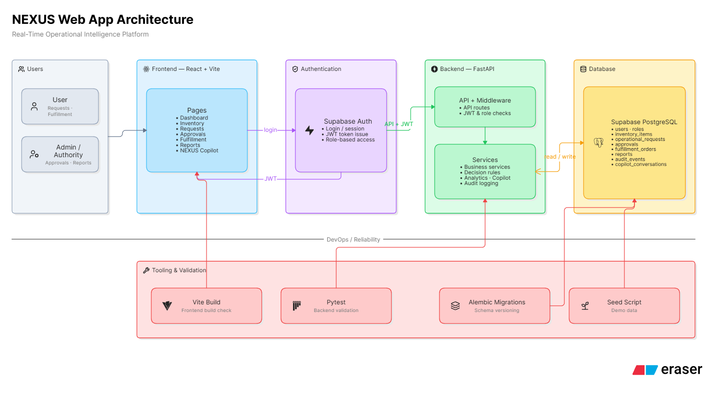

# NEXUS

NEXUS is an operational intelligence web app for inventory-heavy teams. It
connects inventory, requests, approvals, fulfillment, reporting, audit trails,
admin controls, and a database-backed Copilot into one workflow.

The system is built to use real backend data. Dashboard metrics, graphs,
request decisions, AI-style inference, and Copilot answers are calculated from
Supabase PostgreSQL records instead of mock values.



## Features

- Inventory management with stock, reorder, utilization, and location data.
- Operational requests with priority, status, approval, and fulfillment flows.
- Higher-authority approval workflow with role-based access control.
- Fulfillment tracking from queue to processing to allocation.
- Analytics dashboards and insight charts calculated from database records.
- NEXUS Copilot for natural-language operational questions.
- Request detail dossiers with backend-generated AI-style inference.
- Audit logs for important operational actions.
- Admin, policy, settings, and AI engineering screens.
- Supabase Auth login with JWT validation.
- Supabase PostgreSQL database with Alembic migrations.

## Tech Stack

| Layer | Technology |
| --- | --- |
| Frontend | React, TypeScript, Vite, Tailwind CSS, Zustand, Recharts |
| Backend | FastAPI, SQLAlchemy, Pydantic, Alembic |
| Auth | Supabase Auth, JWT, RBAC |
| Database | Supabase PostgreSQL |
| Testing | pytest, TypeScript build, Vite production build |
| Documentation | Markdown docs, evidence logs, presentation material |

## Repository Structure

```text
.
|-- Backend/          FastAPI backend, migrations, seed scripts, tests
|-- Fronted/          React + Vite frontend
|-- docs/             Architecture, API, design, user guide, evidence summary
|-- documents/        Assessment documentation pack and proof artifacts
|-- images/           Supporting images
|-- how to run.txtt   Local run notes
```

Note: the frontend folder is named `Fronted` in this project.

## Architecture Summary

```text
User/Admin
  -> React + Vite Frontend
  -> Supabase Auth
  -> FastAPI Backend
  -> Supabase PostgreSQL

Alembic migrations create the database schema.
Seed scripts populate demo operational records.
Backend services calculate decisions, metrics, reports, inference, and Copilot answers.
```

Core backend modules:

- `app/api/routes/` - FastAPI API routes.
- `app/services/` - business logic and analytics.
- `app/models/` - SQLAlchemy database models.
- `app/security/` - JWT validation and RBAC helpers.
- `app/database/seed.py` - deterministic demo data seed.
- `migrations/` - Alembic schema migrations.

## Prerequisites

- Python 3.11+
- Node.js 18+
- npm
- Supabase project with PostgreSQL and Auth enabled
- Git

## Environment Variables

Create local environment files from the examples:

```powershell
Copy-Item Backend\.env.example Backend\.env
Copy-Item Fronted\.env.example Fronted\.env
```

Required backend variables:

```text
DATABASE_URL or SUPABASE_DB_URL
SUPABASE_URL
SUPABASE_ANON_KEY
SUPABASE_JWT_SECRET or SUPABASE_JWKS_URL
ENVIRONMENT=development
ALLOW_DEV_AUTH_FALLBACK=false
```

Required frontend variables:

```text
VITE_SUPABASE_URL
VITE_SUPABASE_ANON_KEY
VITE_API_URL=/api
```

Do not commit real `.env` files, database passwords, JWT secrets, service role
keys, or connection strings.

## Backend Setup

```powershell
cd Backend
python -m venv .venv
.\.venv\Scripts\python.exe -m pip install -r requirements.txt
```

Run migrations:

```powershell
.\.venv\Scripts\python.exe -m alembic upgrade head
```

Seed demo data:

```powershell
.\.venv\Scripts\python.exe -m app.database.seed
```

Start the backend:

```powershell
.\.venv\Scripts\python.exe -m uvicorn app.main:app --host 127.0.0.1 --port 8000
```

Health check:

```powershell
Invoke-RestMethod http://127.0.0.1:8000/api/health
```

## Frontend Setup

Open a second PowerShell window:

```powershell
cd Fronted
npm install
npm run dev -- --host 127.0.0.1
```

Frontend URL:

```text
http://127.0.0.1:3000
```

Backend URL:

```text
http://127.0.0.1:8000
```

## Vercel Deployment

The deployed frontend is:

```text
https://nexus-xi-eight-21.vercel.app
```

Deploy the backend as a separate Vercel project from the `Backend` root
directory. The repository includes `Backend/api/index.py` and
`Backend/vercel.json` so Vercel can run the FastAPI app as a Python function.

Backend Vercel environment variables:

```text
ENVIRONMENT=production
APP_NAME=NEXUS Backend
API_PREFIX=/api
FRONTEND_URL=https://nexus-xi-eight-21.vercel.app
CORS_ORIGINS=https://nexus-xi-eight-21.vercel.app
SUPABASE_URL=<your Supabase project URL>
SUPABASE_ANON_KEY=<your Supabase anon or publishable key>
DATABASE_URL=<your Supabase PostgreSQL URI>
SUPABASE_JWKS_URL=<your Supabase JWKS URL>
JWT_AUDIENCE=authenticated
JWT_ALGORITHMS=RS256,ES256,HS256
ALLOW_DEV_AUTH_FALLBACK=false
DB_POOL_SIZE=1
DB_MAX_OVERFLOW=1
```

For Vercel/serverless, use the Supabase pooler URI for `DATABASE_URL` if your
Supabase project provides one. Do not put database credentials in frontend
environment variables.

After backend deployment, update the frontend Vercel project:

```text
VITE_API_URL=https://<your-backend-vercel-domain>/api
```

Redeploy the frontend after changing `VITE_API_URL`.

## Demo Authentication

The database seed creates NEXUS application users and roles. Browser login is
owned by Supabase Auth, so matching Auth users must also exist in Supabase.

For local demo use:

1. Create Supabase Auth users with emails matching the seeded NEXUS users.
2. Set a temporary local password in Supabase Auth.
3. Confirm the users if email confirmation is enabled.
4. Log in through the frontend.

Do not publish real passwords or Supabase service keys in this repository.

## Tests and Build Checks

Backend tests:

```powershell
cd Backend
.\.venv\Scripts\python.exe -m pytest -q
```

Frontend production build:

```powershell
cd Fronted
npm run build
```

Expected backend result for the current implementation:

```text
16 passed, 1 warning
```

## Documentation

Main documentation:

- `docs/architecture.md`
- `docs/design.md`
- `docs/api-reference.md`
- `docs/user-guide.md`
- `docs/assessment-evidence.md`

Assessment documentation pack:

- `documents/01_problem_solution.md`
- `documents/02_architecture.md`
- `documents/03_design_data_model.md`
- `documents/04_api_auth_reference.md`
- `documents/05_user_guide.md`
- `documents/06_testing_ai_loop_robustness.md`
- `documents/07_agents_used.md`
- `documents/08_unique_features_and_roadmap.md`
- `documents/09_demo_script_and_deck.md`
- `documents/10_presentation_slide_content.md`

Evidence files are stored in `documents/evidence/`.

## Security Notes

- SQLite is intentionally rejected by backend configuration.
- Real credentials are excluded through `.gitignore`.
- Supabase Auth tokens are validated before protected backend access.
- Role-based access control protects authority and admin operations.
- Business decisions are deterministic backend rules, not uncontrolled AI output.

## Project Status

The repository includes the full NEXUS Phase 1-3 implementation, Supabase-backed
database integration, backend tests, frontend build configuration, documentation,
architecture material, and demo presentation assets.

Phase 4 can build on this foundation with deeper workflow automation,
end-to-end browser tests, CI, and optional real LLM integration for Copilot.
