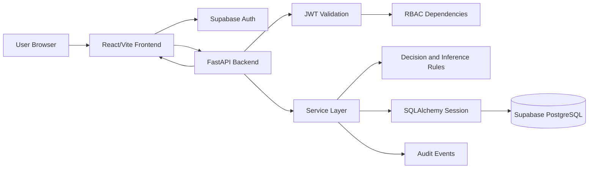

# Architecture

## System Overview

NEXUS is a three-layer web application:

- Frontend: React, Vite, TypeScript, Zustand, React Router, Recharts.
- Backend: FastAPI, SQLAlchemy, Alembic, Pydantic settings, service-layer logic.
- Data/Auth: Supabase PostgreSQL and Supabase Auth.

The browser authenticates with Supabase Auth, then calls FastAPI with a bearer
token. FastAPI validates the token, resolves the NEXUS user, applies RBAC, and
executes database-backed services.

## Component Diagram

## Frontend Architecture

Important folders:

- `Fronted/src/pages` - screen-level route components.
- `Fronted/src/api` - typed API clients.
- `Fronted/src/store` - auth, operations, health, notification, and UI state.
- `Fronted/src/components/ui` - reusable app controls.
- `Fronted/src/components/operations` - workflow-specific reusable components.

Key frontend decisions:

- Routes are lazy-loaded.
- Authenticated route chunks preload after login.
- Bootstrap data is cached and deduplicated to reduce page wait time.
- Dashboard and Insights reuse backend bootstrap summaries instead of making
  duplicate requests.
- Request detail/inference UI is reusable across Dashboard and Requests.

## Backend Architecture

Important folders:

- `Backend/app/api/routes` - thin FastAPI route handlers.
- `Backend/app/services` - business logic and calculations.
- `Backend/app/models` - SQLAlchemy models and relationships.
- `Backend/app/database` - session management, seed, auth seed, health.
- `Backend/app/security` - JWT and RBAC helpers.
- `Backend/migrations` - Alembic migration history.
- `Backend/tests` - pytest tests.

Backend principles:

- Routes stay thin and call service functions.
- Business rules are deterministic and testable.
- SQLAlchemy uses PostgreSQL through the configured Supabase URL.
- SQLite is intentionally rejected by configuration validation.
- Secrets are read from `.env` and are not hardcoded.
- Health checks verify database connectivity without exposing credentials.

## Data Flow

### Login

1. User enters email and password.
2. Frontend calls Supabase Auth.
3. Supabase returns an access token.
4. Frontend stores the token in the auth store.
5. API client sends `Authorization: Bearer <token>`.
6. FastAPI validates the token and maps the email/auth ID to `users`.

### Dashboard Load

1. App layout calls `GET /api/bootstrap`.
2. Backend returns inventory, requests, approvals, fulfillment, reports, audit,
   dashboard summary, and insights summary.
3. Frontend stores the payload in Zustand.
4. Dashboard and Insights read cached calculated summaries.

### Request Inference

1. User clicks a request card or dashboard request row.
2. A dossier modal opens.
3. User clicks `Get AI Inference`.
4. Frontend calls `POST /api/copilot/inference`.
5. Backend calculates risk, evidence, confidence, and next action from DB rows.
6. User can click `More Info in Copilot` to continue a chat with that context.

## Deployment Shape

Local development:

- Backend: `http://127.0.0.1:8000`.
- Frontend: `http://127.0.0.1:3000`.
- Database/Auth: Supabase cloud project.

Production-ready path:

- Host React static build behind HTTPS.
- Host FastAPI behind an HTTPS gateway.
- Use Supabase connection pooling for serverless or high-concurrency deploys.
- Keep database and auth secrets in environment variables.
- Add CI jobs for tests, build, migration check, and security scan.
